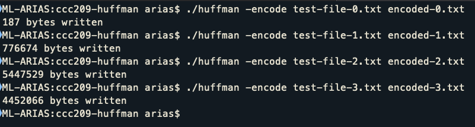
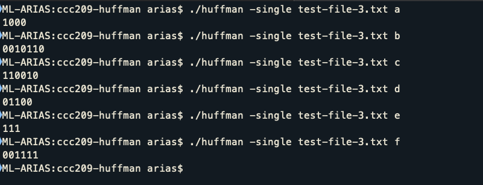
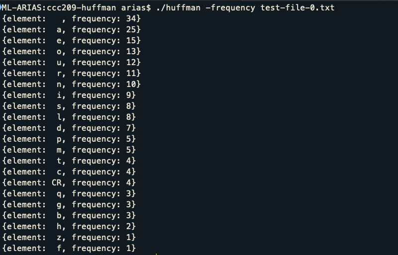
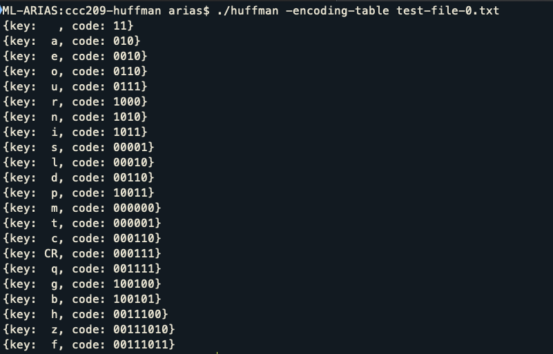

# Encoding Text Files using Huffman Trees


## Purpose
The goal of this lab is to implement the Huffman Tree Encoding. Some of the skills you will practice in this lab are:
- Implementation and use of the Tree Data Structure
- Using files for input and output
- Design a program from scratch
- Use command line parameters

## Design
You are free to create the design to solve this problem. The general steps
for this program are:
1. Open the file for input and create the Frequency Table. This table counts the occurrences of each character in the file.
1. Sort the Frequency Table on frequency.
   To sort the table use the following comparison:
   ```c++
   if (tableElement1.frequency == tableElement2.frequency)
		return tableElement1.element > tableElement2.element;
   else
		return tableElement1.frequency > tableElement2.frequency;
   ```
   Basically, by using that comparison, you will be sorting your Frequency Table first by frequency and then by element. Example:

   Before Sorting
   |Element | Frequency |
   | ------ | --------- |
   | a      | 10        |
   | b      | 2         |
   | c      | 2         |
   | d      | 9         |
   | e      | 12        |

   After Sorting
   |Element | Frequency |
   | ------ | --------- |
   | e      | 12        |
   | a      | 10        |
   | d      | 9         |
   | c      | 2         |
   | b      | 2         |

   Notice that b and c have the same frequency, since we are sorting first by frequency and then by element, c ends up higher in the table as it is greater than b.
1. Using the Frequency Table create the Huffman Tree from bottom up.
1. Once the tree is created, traverse it to create the code for each of the
symbols (characters) found in the file. This will result in a Encoding Table.
1. Using the Encoding Table read the input file, and for each character use the table
to get the encoding and write the encoding into the output file.

### Extra Challenge
1. Add an option to decode the encoded file.
1. To be able to decode you are going to need to store the Huffman Tree in the encoded file.
1. The resulting file must be identical to the original file.

### Ultra - Extra Challenge
1. Using bitwise operations, convert the binary string generated by the encoding phase into actual binary representation, this will result in a compressed file, that should be smaller than the original file.
1. You need to provide the decoding to verify that your program is working.


## What is given?
You are given sixteen files:
- `test-file-0.txt` the first input file, the beginning of a song
- `test-file-0.table` the output to screen of the *encoding table* for the first file
- `test-file-0.encoded` the encoded file produced from the first file
- `test-file-0.frequency` the output to screen of the *frequency table* for the first file
- `test-file-1.txt` the first input file, A Tale of Two Cities
- `test-file-1.table` the output to screen of the *encoding table* for the first file
- `test-file-1.encoded` the encoded file produced from the first file
- `test-file-1.frequency` the output to screen of the *frequency table* for the first file
- `test-file-2.txt` the first input file, The Complete Works of William Shakespeare
- `test-file-2.table` the output to screen of the *encoding table* for the first file
- `test-file-2.encoded` the encoded file produced from the first file
- `test-file-2.frequency` the output to screen of the *frequency table* for the first file
- `test-file-3.txt` the first input file, The King James Bible
- `test-file-3.table` the output to screen of the *encoding table* for the first file
- `test-file-3.encoded` the encoded file produced from the first file
- `test-file-3.frequency` the output to screen of the *frequency table* for the first file

## How the program is supposed to work

Ideally you should write a makefile, but you can compile the following way:
```
g++ yoursource1.cpp yoursource2.cpp -o huffman -std=c++14 -Wall
```
This will result in an executable named `huffman`, remember to specify the name of the executable in case you make your own `makefile`. The program should work with command line parameters the following way:
- `./huffman -encode inputfile outputfile`
	-	It will encode the file `inpufile` and create a file `outputfile` with the huffman encoding of the first file. It outputs the number of bytes written to the `outputfile`
- `./huffman -single inputfile c`
  - It will encode the file `inputfile`, and then it will print the string of 0's and 1's representing the given `c` character. If a string is given as the `c` parameter, it will only use the first character of the string
- `./huffman -frequency inputfile`
  - It will output to console the frequency table of the `inputfile`
- `./huffman -encoding-table inputfile`
  - It will output to console the encoding table of the `inputfile`
- `./huffman -decode inputfile outputfile`
  -	**Optional** It will decode the `inputfile` and write the decoded information into the `outputfile`


### Examples:
To encode a file named `mybook.txt` and put the encoding into a file named `myencodedbook.txt`:
```
./huffman -encode mybook.txt myencodedbook.txt
```

To decode a file named `coded.txt` and create a decoded file named `original.txt`:
```
./huffman -decode coded.txt original.txt
```

### Expected output

#### `./huffman -encode inputfile outputfile`
When encoding a file, your program is expected to output to console the number of bytes written to the `outputfile`. The encoded file (without extra challenge) will be a single line with 0's and 1's only.


#### `./huffman -single inputfile c`
When outputting the encoding of a single character, your program just needs to output the binary string that represents that character.


#### `./huffman -frequency inputfile`
When outputting the frequency table, the table needs to be sorted, first by frequency and then by character. Each one of the elements of the frequency table will be displayed using the following format:
```
{element:  c, frequency: 11}
```
Notice that there are no trailing spaces, and that the after the colon of `element`, there are two spaces for single characters, and a single space for special characters (`CR` or `LF`). Furthermore, notice that only the characters in the file are displayed!



For certain characters the element is changed to be able to display:
- CR for displaying character `'\r'`
- LF for displaying character `'\n'`
Check [Escape Sequences](https://en.cppreference.com/w/cpp/language/escape).

#### `./huffman -encoding-table inputfile`
When outputting the encoding table that is created with an `inputfile` you will output to console the encoding table sorted by code with shorter codes first. Each element of this table will have the following format:
```
{element:  a, code: 010}
```
Notice that there are no trailing spaces, and that the after the colon of `element`, there are two spaces for single characters, and a single space for special characters (`CR` or `LF`). Furthermore, notice that only the characters in the file are displayed!



For certain characters the element is changed to be able to display:
- CR for displaying character `'\n'`
- LF for displaying character `'\r'`

#### `./huffman -decode inputfile outputfile`
This is an *optional* operation if you wish to get extra credit. No output to screen is expected for this operation.


## What is expected?
- Your code ***must*** compile.
- Your code ***must not*** compile with warnings.
- Your program ***must not*** crash.
- Your program ***must not*** have memory leaks or memory issues. (Use `valgrind`)
- Your program is expected to implement a Tree Data Structure, there will be a code inspection to verify this.
- Every source file must contain header comments with the following format:
 ```
 /*
  Filename: huffmantree.h
  Description: Declaration of the class HuffmanTree to represent the binary Huffman Tree
  Author: McDonald Berger
  Date: 05/29/2019
  Course: Data Structures II
 */
 ```
- The program will be tested with the given files, and with additional files. Your grade will be calculated based on the screen output and file output. These outputs must be identical to the given outputs.
- Your code needs to show good programming practices: appropriate amount of
comments for your methods, indentation, meaningful
variable names, identifiers convention (CamelCase for functions, camelCase
for variables, _camelCase for data members, SNAKE_CASE for constants),
header comments, correct file names, etc. Failure to code appropriate will
result in strong points penalization.
- Check Canvas page: Good Programming Practices for a thorough list of good programming practices that you are expected to follow.

## How to Test your Lab
Once you finished coding your lab you may want to test it to check it is correctly working.

### Testing Encoding
1. Compile your program, make sure the executable name is `huffman`
1. Run the program using the first input file: `./huffman -encode test-file-0.txt my-0.encoded`
1. Previous step will create file:
   1. `my-0.encoded` contains the encoded file `test-file-0.txt`
1. Compare the files, if there is no output, it means the files are identical and your program is working as expected.
   1. `diff test-file-0.encoded my-0.encoded` This will check if your encoded file is identical to the given file.
1. Compare the character count:
   1. `test-file-0.txt` the encoding writes 187 bytes
	 1. `test-file-1.txt` the encoding writes 776674 bytes
	 1. `test-file-2.txt` the encoding writes 5447529 bytes
	 1. `test-file-3.txt` the encoding writes 4452066 bytes

### Testing Single Character
1. Compile your program, make sure the executable name is `huffman`
1. Run the program using the first input file and the encoding of letter `a`: `./huffman -single test-file-0.txt a`
1. Previous step will output: `010`
2. You can use the tables shown in [Encoding Table](#Testing-Encoding-Table) to check all the possible encodings for each letter of each of the files that are provided. Additionally, the following files have the encoding tables for each of the four provided files:
	1. [`test-file-0.table`](test-file-0.table) contains the encoding table for [`test-file-0.txt`](test-file-0.txt)
	1. [`test-file-1.table`](test-file-1.table) contains the encoding table for [`test-file-1.txt`](test-file-1.txt)
	1. [`test-file-2.table`](test-file-2.table) contains the encoding table for [`test-file-2.txt`](test-file-2.txt)
	1. [`test-file-3.table`](test-file-3.table) contains the encoding table for [`test-file-3.txt`](test-file-3.txt)


### Testing Frequency Table  
1. Compile your program, make sure the executable name is `huffman`
1. Run the program using the first input file: `./huffman -frequency test-file-0.txt`
2. The previous step will output to the screen the frequency table for `test-file-0.txt`, you can check the output comparing with file `test-file-0.frequency`, if you want to automate this test, follow the next step.
3. Checking if your frequency table is identical to the expected frequency table
   1. Run the program using the first input file: `./huffman -frequency test-file-0.txt > my-0.frequency`
   2. The previous command will redirect the output to file `my-0.frequency`
   3. Compare your frequency table with the provided frequency table: `diff test-file-0.frequency my-0.frequency`
   4. The `diff` command will compare the provided expected output for the frequency table for `test-file-0.txt` and compare it with the table that is generated by your program. If the two files are identical, there will be no output after this command.
1. The following files have the frequency tables for each of the four provided files:
	1. [`test-file-0.frequency`](test-file-0.frequency) contains the frequency table for [`test-file-0.txt`](test-file-0.txt)
	1. [`test-file-1.frequency`](test-file-1.frequency) contains the frequency table for [`test-file-1.txt`](test-file-1.txt)
	1. [`test-file-2.frequency`](test-file-2.frequency) contains the frequency table for [`test-file-2.txt`](test-file-2.txt)
	1. [`test-file-3.frequency`](test-file-3.frequency) contains the frequency table for [`test-file-3.txt`](test-file-3.txt)


### Testing Encoding Table
1. Compile your program, make sure the executable name is `huffman`
1. Run the program using the first input file: `./huffman -encoding-table test-file-0.txt`
2. The previous step will output to the screen the encoding table for `test-file-0.txt`, you can check the output comparing with file `test-file-0.table`, if you want to automate this test, follow the next step.
3. Checking if your encoding table is identical to the expected frequency table
   1. Run the program using the first input file: `./huffman -encoding-table test-file-0.txt > my-0.table`
   2. The previous command will redirect the output to file `my-0.table`
   3. Compare your encoding table with the provided encoding table: `diff test-file-0.table my-0.table`
   4. The `diff` command will compare the provided expected output for the encoding table for `test-file-0.txt` and compare it with the table that is generated by your program. If the two files are identical, there will be no output after this command.
1. The following files have the encoding tables for each of the four provided files:
	1. [`test-file-0.table`](test-file-0.table) contains the encoding table for [`test-file-0.txt`](test-file-0.txt)
	1. [`test-file-1.table`](test-file-1.table) contains the encoding table for [`test-file-1.txt`](test-file-1.txt)
	1. [`test-file-2.table`](test-file-2.table) contains the encoding table for [`test-file-2.txt`](test-file-2.txt)
	1. [`test-file-3.table`](test-file-3.table) contains the encoding table for [`test-file-3.txt`](test-file-3.txt)


### If you are doing the extra credit
The comparison of the encoded files will fail, since you will have to save the Huffman Tree in the beginning of the file. So, you will need to follow this steps (Applies for Extra Challenge and for Ultra - Extra Challenge).
1. Run the program to decode: `./huffman -decode my-0.encoded my-0.decoded`
1. The previous command will convert the encoded file into the original file
1. Compare the file with the original: `diff my-0.decoded test-file-0.txt` if there is no output, it means the files are identical and your program is working as expected.

NOTE: If you are using the Windows command line, you will need to use `fc` instead of `diff`.

## Grading

| Item | Points | Description |
| :------------- | :------------- | :---------|
| Correct Encoding for Single Character   | 15  | Shows the correct encoding of a single character, there will be a number of characters tested  |
| Frequency Table   | 30  | Shows the correctly sorted frequency table of the given file  |
| Encoding Table   | 20  |  Shows the correctly sorted encoding table of the given file |
| Encodes   | 35 | The program correctly encodes a given file  |

### Extra credit
Once you have finished the standard credit, then you can start working on the extra credit. Remember that for decoding it is necessary to store the encoding table inside the encoded file.
- The program encodes **and** decodes, the decoded file must be identical to the original file. Extra points: 50
- The program uses bitwise operations to store the 0's and 1's as bits. Extra points: 100, must provide decoding operation to verify. Does not accumulate the previous extra credit.

### Deductions
- The program does not have Tree Data Structure, the final grade will be 0
- The program does not compile, the final grade will be 0
- The program doesn't show good programming practices, -5 deduction per infraction
  - Remember to pass non-primitive types by reference
  - Remember to set to `const` the methods or parameters when appropriate
  - Remember to take advantage of the initialization syntax
- Your code crashes (runtime error), -20
- Your code compiles with warning, -20
- Your code reports memory leaks or warning on `valgrind`, -20
